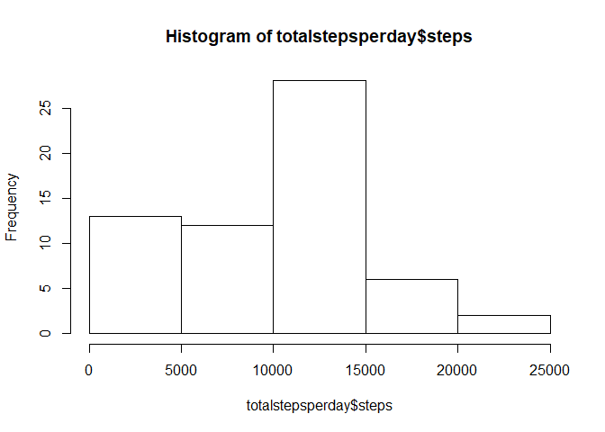
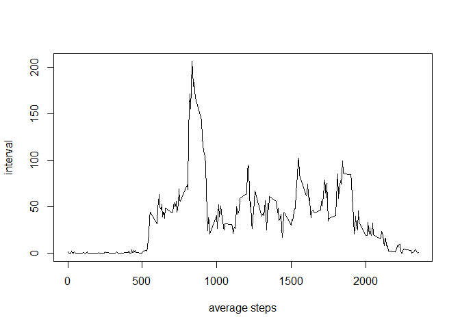
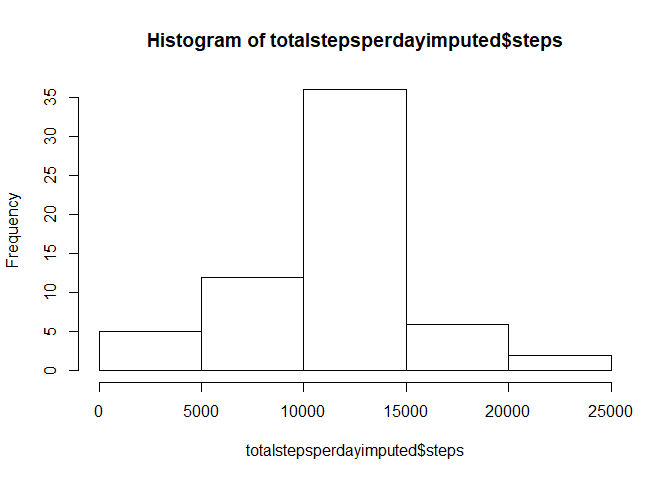
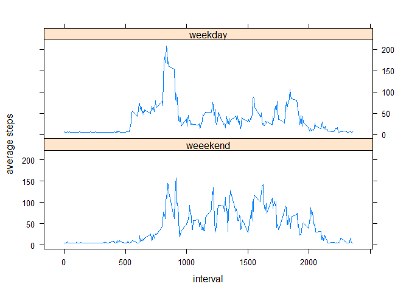

Reproducible Research - Course Project 1
========================================

Loading and preprocessing the data
----------------------------------

1.  Load the data

<!-- -->

    if(!file.exists("activity.csv"))
    {
      unzip("activity.zip")
    }
    x<-read.csv("activity.csv")

1.  Preprocessing the data

<!-- -->

    x$date<-as.Date(x$date,"%Y-%m-%d")

What is mean total number of steps taken per day?
-------------------------------------------------

1.  Calculate the total number of steps taken per day

<!-- -->

    totalstepsperday<-aggregate(x$steps,list(x$date),sum,na.rm=TRUE)
    names(totalstepsperday)<-c("date","steps")

1.  Make a histogram of the total number of steps taken each day

<!-- -->

    hist(totalstepsperday$steps)

1.  Calculate and report the mean and median of the total number of
    steps taken per day

<!-- -->

    meantotalstepsperday<-mean(totalstepsperday$steps)
    mediantotalstepsperday<-median(totalstepsperday$steps)

Mean = 9354.2295082, Median = 10395

What is the average daily activity pattern?
-------------------------------------------

1.  Make a time series plot of the 5-minute interval (x-axis) and the
    average number of steps taken, averaged across all days (y-axis)

<!-- -->

    averagestepsperinterval<-aggregate(steps~interval,x,mean)
    plot(averagestepsperinterval$interval,averagestepsperinterval$steps,type = "l",xlab = "average steps",ylab = "interval")

1.  Which 5-minute interval, on average across all the days in the
    dataset, contains the maximum number of steps?

<!-- -->

    maxinterval<-averagestepsperinterval[which(averagestepsperinterval$steps==max(averagestepsperinterval$steps)),1]

Interval which contains the maximum number of steps = 835

Imputing missing values
-----------------------

1.  Calculate and report the total number of missing values in the
    dataset

<!-- -->

    totalNA<-sum(is.na(x$steps))

Total number of missing value = 2304

1.  Devise a strategy for filling in all of the missing values in the
    dataset.

Replacing NA values with mean of the data

1.  Create a new dataset that is equal to the original dataset but with
    the missing data filled in.

<!-- -->

    library(Hmisc)
    ximputed<-x
    ximputed$steps<-impute(ximputed$steps,fun = mean)

1.  Make a histogram of the total number of steps taken each day and
    Calculate and report the mean and median total number of steps taken
    per day. Do these values differ from the estimates from the first
    part of the assignment? What is the impact of imputing missing data
    on the estimates of the total daily number of steps?

<!-- -->

    totalstepsperdayimputed<-aggregate(steps~date,ximputed,sum)
    hist(totalstepsperdayimputed$steps)

    meantotalstepsperdayimputed<-mean(totalstepsperdayimputed$steps)
    mediantotalstepsperdayimputed<-median(totalstepsperdayimputed$steps)
    changeinmean<-meantotalstepsperdayimputed-meantotalstepsperday
    changeinmedian<-mediantotalstepsperdayimputed-mediantotalstepsperday

Imputed mean = 1.076618910^{4}, Imputed median = 1.076618910^{4}, Change
in mean = 1411.959171, Change in median = 371.1886792

Are there differences in activity patterns between weekdays and weekends?
-------------------------------------------------------------------------

1.  Create a new factor variable in the dataset with two levels -
    "weekday" and "weekend" indicating whether a given date is a weekday
    or weekend day.

<!-- -->

    ximputed$datetype<-ifelse(weekdays(ximputed$date)=="Saturday"|weekdays(ximputed$date)=="Sunday","weeekend","weekday")

1.  Make a panel plot containing a time series plot (i.e. type="l") of
    the 5-minute interval (x-axis) and the average number of steps
    taken, averaged across all weekday days or weekend days (y-axis).

<!-- -->

    averagestepsperintervalperdatetype<-aggregate(steps~interval+datetype,ximputed,mean)
    xyplot(steps~interval|datetype,averagestepsperintervalperdatetype,type="l",xlab="interval",ylab="average steps",layout=c(1,2))

